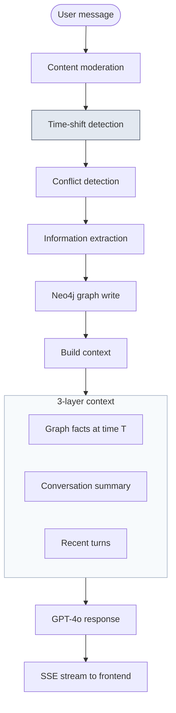

# KGraph

LLMs are surprisingly bad at tracking characters during long roleplay conversations. Tell ChatGPT about a married couple with three kids, jump the story back to their honeymoon, and the kids will still show up — because the model has no concept of *when* facts are valid.

KGraph is a chatbot that solves this with a temporal knowledge graph. It extracts characters and relationships from conversation, tags them with time metadata, and filters the graph whenever the narrative shifts to a different point in the story. The result: if the story moves to before the kids were born, they don't exist yet.

> *I was motivated to make this because one of my hobbies is storytelling ping-pong with ChatGPT, and one of its noticeable drawbacks is that GPT tends to forget the family relationships that are built through the chat.* — from the [original project retrospective](https://hangoeun16.github.io/blog/2026/reflection_on_KG/).

<!-- TODO: add demo GIF here -->
<!--  -->

## Features

- **Real-time entity & relationship extraction** — Mention characters in plain dialogue ("Kim is married to Jim, they have 3 kids") and the graph builds itself; no forms, no commands.
- **Temporal filtering** — Jump the story to any point in time and the graph adjusts: characters who aren't born yet, or relationships that haven't formed, simply don't appear.
- **Family inference** — Ask about grandparents, aunts, or cousins and they're derived from primitive relations on the fly, even if never stated directly.
- **Contradiction detection** — Say a character is 4, then later 6, and the chatbot flags the conflict instead of silently overwriting.
- **Unnamed placeholders** — "They have 3 kids" creates three tracked children; name them later ("the oldest is Jack") and the placeholder is filled in.
- **Live graph visualization** — Open the graph view any time to see the current family structure as nodes and edges.
- **Content moderation** — User input is safety-checked before processing.

## Key mechanisms

- **Temporal graph** — Nodes and edges carry time ranges. Cypher queries filter by the active time point, so past scenes exclude future characters.
- **Family ontology** — Four primitive relations ([FHKB](https://www.cs.man.ac.uk/~stevensr/ontology/family.html)-inspired); grandparent, uncle, cousin inferred via graph traversal.
- **Structured extraction** — Pydantic schemas + OpenAI structured output replace manual JSON parsing.
- **Hybrid memory** — Last 20 turns verbatim + LLM-compressed summary of older history.
- **SSE streaming** — Natural language status messages during pipeline stages, then token-by-token response.

## Architecture



### Project structure

```
app.py                     FastAPI endpoints + SSE streaming
│
├── pipeline/
│   ├── orchestrator.py    6-stage processing pipeline
│   ├── applier.py         Extraction results → Neo4j writes
│   └── moderator.py       Content safety (OpenAI Moderation API)
│
├── extraction/
│   ├── client.py          Async OpenAI client with structured output
│   └── service.py         6 extraction/detection methods
│
├── graph/
│   ├── store.py           Neo4j async CRUD operations
│   ├── queries.py         Cypher query constants
│   └── temporal.py        Timeline event management
│
├── memory/
│   ├── manager.py         3-layer context builder
│   ├── store.py           Conversation buffer (sliding window)
│   └── summarizer.py      LLM-based turn compression
│
├── models/                Pydantic data models
├── prompts/               LLM prompt templates
├── templates/             HTML (Jinja2)
└── static/                CSS + JS
```

### Processing pipeline

Each user message passes through six stages:

1. **Content moderation** — OpenAI Moderation API safety check.
2. **Time-shift detection** — LLM analyzes the message against the recorded timeline to detect narrative time jumps.
3. **Conflict detection** — Checks for direct contradictions with existing facts (skipped when naming unnamed characters).
4. **Information extraction** — Parallel extraction of family relations, personal attributes, and social connections.
5. **Graph application** — Extracted information is written to Neo4j with temporal metadata.
6. **Response streaming** — LLM generates a response using the full context (graph facts + conversation summary + recent turns), streamed via SSE.

## Tech stack

| Layer | Technology | Why |
|-------|-----------|-----|
| API | FastAPI | Async-native, Pydantic integration, SSE via `StreamingResponse` |
| LLM | OpenAI GPT-4o | Structured output for type-safe extraction |
| Graph DB | Neo4j | Cypher queries for multi-hop relation inference and temporal filtering |
| Data models | Pydantic v2 | Schema validation for LLM responses, API contracts, and graph entities |
| Frontend | Vanilla HTML/CSS/JS | Minimal, no framework overhead |
| Infra | Docker Compose | One-command setup: `docker compose up` |

## Getting started

### Prerequisites

- Docker and Docker Compose
- OpenAI API key

### Setup

```bash
git clone https://github.com/hangoeun16/kgraph-chatbot.git
cd kgraph-chatbot

cp .env.example .env
# Edit .env with your OPENAI_API_KEY and NEO4J_PASSWORD

docker compose up
```

The app will be available at `http://localhost:8000`.

Neo4j Browser (for inspecting the graph directly) is at `http://localhost:7474`.

### Local development (without Docker)

```bash
pip install -r requirements.txt

# Start Neo4j separately (e.g., Neo4j Desktop or `docker run neo4j:5-community`)
# Set environment variables:
export OPENAI_API_KEY=sk-...
export NEO4J_URI=bolt://localhost:7687
export NEO4J_USER=neo4j
export NEO4J_PASSWORD=...

python app.py
```

## Example: timeline jumps in action

The core feature is temporal filtering — the graph changes depending on *when* the story is.

### Building the world

```
User: Kim is married to Jim. They have 3 kids.
  → Graph: spouse_of(Kim, Jim), 3 placeholder children
  → Timeline: Event 1 — "Kim and Jim married"
              Event 2 — "3 children"

User: The oldest is Mia. She's 15.
  → Placeholder renamed → Mia, age=15
```

### Jumping backward

```
User: Let's go back to their honeymoon.
  → Time-shift detected: "right after marriage, before children"
  → Active time point moves to Event 1

  What the LLM sees:          What it does NOT see:
  ✓ Kim exists                ✗ Mia (exists_from=2)
  ✓ Jim exists                ✗ Child #2 (exists_from=2)
  ✓ Kim spouse_of Jim         ✗ Child #3 (exists_from=2)
```

### Jumping forward

```
User: Now skip ahead to when Mia is in college.
  → Time-shift detected: "Mia is ~18, several years after Event 2"
  → New event recorded, active time point advances

  ✓ All 3 children exist
  ✓ Mia's age context: college-age
  ✓ Full family visible
```

The same graph stores all the data — only the *view* changes based on the active time point.

## Why temporal knowledge graphs?

Narrative conversations require two kinds of memory that standard LLM approaches don't separate:

**Factual consistency** — knowing that Kim is married to Jim. Traditional RAG and conversation memory handle this reasonably well: store facts, retrieve them when relevant.

**Temporal consistency** — knowing that Kim *wasn't yet* married to Jim at the point in the story we're currently in. This is where most systems break down, because they treat all stored facts as equally valid regardless of narrative time.

The insight behind KGraph is that a knowledge graph is the natural structure for the first problem, and adding time metadata to its nodes and edges is a minimal extension that solves the second. Rather than building a separate temporal reasoning system, the graph itself *is* the temporal model — queries just filter by the current time point.

This matters beyond roleplay. Any AI system that manages evolving state over time — interactive fiction, game NPCs, biographical assistants, legal case tracking — faces the same fundamental challenge: facts have lifespans.

## Design decisions

**Why Neo4j over NetworkX?** The original prototype used NetworkX in-memory graphs. This worked for small graphs but had no persistence, no query language for multi-hop traversal, and no way to filter by temporal properties without manual Python iteration. Neo4j's Cypher lets us express "find Kim's grandchildren who exist at time point 3" in a single query.

**Why structured output over JSON parsing?** The original code extracted JSON from LLM responses using `response.find('[')` and `response.rfind(']')` — fragile and caused silent failures when the LLM returned malformed JSON. Structured output guarantees schema conformance and eliminates an entire class of bugs.

**Why FHKB-inspired ontology?** Storing only primitive relations and inferring the rest via graph traversal means the system doesn't need to enumerate all possible family relation types. Adding a new inferred relation (e.g., cousin) is a Cypher query, not a schema change.

**Why hybrid memory (buffer + summary)?** Pure buffer overflows the context window in long conversations. Pure summary loses conversational nuance. The hybrid approach keeps the last 20 turns verbatim for short-term context while compressing older history into a summary for long-term awareness.

## Limitations and future work

**Temporal reasoning scope.** Currently handles explicit time expressions ("10 years ago") and semi-implicit ones ("during their honeymoon" — cross-referenced against the event log). Fully implicit temporal reasoning ("when Jim was still working at the company" — requires knowing Jim later quit) is not yet implemented. This is documented as a deliberate scope boundary, not an oversight.

**Single-user design.** The current architecture uses a single pipeline instance. Production deployment would need session management and per-user graph namespacing.

**Graph visualization.** The current graph view is a basic SVG circle layout. A force-directed layout library (e.g., D3) would improve readability for larger graphs.

**Conversation memory persistence.** The conversation buffer is in-memory and resets on server restart. Persisting turns to Neo4j or a separate store would enable cross-session memory.

## Potential applications

The temporal consistency problem isn't unique to roleplay. Any AI system managing state that changes over time faces the same challenge:

- **Interactive fiction** — branching narratives where the reader can revisit earlier chapters
- **Game NPCs** — characters whose knowledge and relationships evolve with the game timeline
- **Long-term AI companions** — agents that remember life events *and* when they happened
- **Biographical assistants** — tracking a person's career, relationships, and life stages across decades
- **Legal/medical case tracking** — facts that are valid within specific date ranges

## Open questions

- **Can temporal reasoning be learned?** Currently, time-shift detection relies on prompting. Could a fine-tuned model detect narrative time shifts more reliably, especially implicit ones?
- **How should contradictory timelines be handled?** If a user creates an alternate timeline ("what if they never married?"), should the graph branch or maintain parallel states?
- **Can narrative state become a benchmark?** There's no standard evaluation for temporal consistency in conversational AI. A synthetic family-story dataset with ground-truth time-filtered states could fill that gap.

## Background

This project started from a specific frustration: during roleplay conversations with LLMs, family relationships built across multiple exchanges would be forgotten or contradicted. The original prototype was a course final project using Flask, NetworkX, and LangChain.

That prototype went through several failed approaches before arriving at a working design: multi-layer prompt chains that made even "hi" take over a minute to respond; ChromaDB semantic search that created a cache headache and duplicated storage; three separate attempts at hierarchical family tree visualization (package-based, generation-attribute, LLM-formatted), all of which broke on edge cases like aunts being placed in the same generation as parents, or separate families merging later in the story.

This version is a ground-up rewrite. The core question shifted from "how do I store family relationships" to "how do I make stored relationships respect narrative time" — which turned out to be the harder and more interesting problem.

For the full retrospective — including detailed breakdowns of each abandoned approach — see the [blog post](https://hangoeun16.github.io/).

## License

MIT
